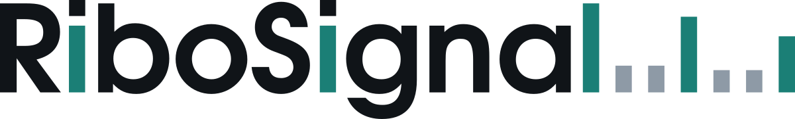

<picture>
  <source media="(prefers-color-scheme: dark)" srcset="assets/ribosignal-wordmark-dark.svg">
  
</picture>

Predicts a **per-nucleotide ribosome P-site profile** for a transcript from its mature mRNA
sequence and matched RNA-seq coverage. No ribosome-profiling experiment is needed at inference.

The predicted profile can be fed to an ORF caller in place of real Ribo-seq, which is what it is
for: calling translated ORFs, including upstream and non-canonical ones, in samples where no
Ribo-seq exists.

## Documentation

Full tutorial, from a clean environment to scored ORF calls on chromosome 22, at
**<https://ribosignal.readthedocs.io>**. It covers fetching and filtering the annotation, the
sequencing data, adapter measurement, alignment, the pack, prediction, ORF calling with four
callers, scoring, the known traps, running on a cluster, and the Nextflow pipeline. Everything
below is the short version; the docs are the reference.

## Weights

<https://huggingface.co/emalek/RiboSignal>

| checkpoint | mixer | params | device |
|---|---|--:|---|
| `mamba4_best.pt` | dilated CNN + 4 bidirectional Mamba blocks | 7,521,026 | GPU, or CPU via the reference path |
| `attn_best.pt` | dilated CNN + 2 transformer layers | 5,071,106 | CPU or GPU |

mamba4 is fastest with `mamba_ssm`'s CUDA kernels. Where that package is absent the mixer falls
back to `scripts/mamba_ref.py`, a transcription of upstream's pure-PyTorch reference; the
checkpoint loads and runs unchanged, just slower. `RIBO_MAMBA_IMPL=cuda` refuses to fall back.

## Quick start

One image carries the aligners, callers, Python stack and both checkpoints. Two tags are built
from the one `containers/Dockerfile.riboseq-model`, so their pins cannot drift: `:cpu`
(`ubuntu`, CPU torch, no `mamba_ssm`) and `:gpu` (`nvidia/cuda`, cu118 torch, prebuilt Mamba
kernels). Both run both checkpoints.

```bash
docker pull ghcr.io/ericmalekos/riboseq-model:cpu   # or :gpu
```

The [documentation](https://ribosignal.readthedocs.io) walks the whole chr22 run: it fetches the
GENCODE reference and the two public accessions, then aligns, packs, predicts, calls and scores.
With your own data the pipeline is one command,

```bash
nextflow run . -profile docker,cpu \
  --rna_fastq 'fastq/*_{1,2}.fastq.gz' --ribo_fastq 'fastq/ribo.fastq.gz' \
  --gtf ref/annotation.gtf --fasta ref/genome.fa
```

and `nextflow run . --help` lists every parameter. The `test` profile reruns the tutorial's chr22
case once its two FASTQs are in `./fastq/`; the pipeline auto-fetches the reference but not the
reads.

## Training

Human tissue Ribo-seq (GEO **GSE182371**), leave-one-tissue-out with Hepatocytes held out,
unique-mapper alignments only. `scripts/train.py` is the entry point. The exact configuration and
held-out metrics for each checkpoint ship with the weights as `<arch>_config.json` and
`<arch>_test_metrics.json`.

`release/orf_v2_*/test_metrics.json` carries a `spearman_median_INVALID_ordinal_ties` key. The
name is the warning: that rank correlation was computed with ordinal ranks and no tie averaging,
which on profiles that are 74 to 95% zeros ranks position rather than signal and drives the value
negative. It is kept, renamed, for provenance and must not be read as a correlation. The defect
touched that one reported metric only; it fed neither the loss nor checkpoint selection, so no
model is affected. Pearson and periodicity in the same files are unaffected.

## Citation

Manuscript in preparation. Until then cite this repository and
<https://huggingface.co/emalek/RiboSignal>.

## License

**Not yet specified.** No licence is granted for the code in this repository, so there is no
permission to use, copy, modify or redistribute it. If you need one, open an issue.

This is narrower than it may look from elsewhere: the model card and `LICENSE` at
<https://huggingface.co/emalek/RiboSignal> say MIT, and that covers **the released weights and the
copy of `model.py` published beside them**, not this repository.

Training data are third-party public datasets under their own terms and are covered by neither.
